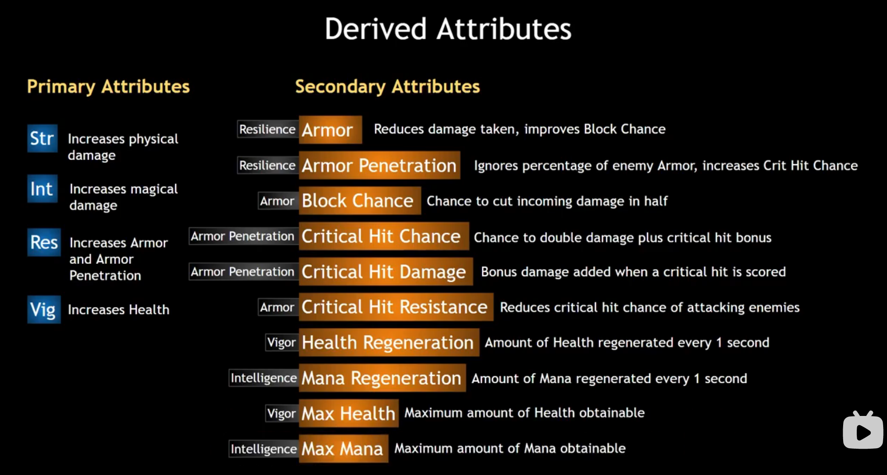

### Attributes
- 
- Primary Attributes
  1. **Strength**
  2. **Intelligence**
  3. **Resilience**
  4. **Vigor**
- Secondary Attributes
  1. **Armor** = ( 2 + Resilience ) * 0.25 + 6
  2. **ArmorPenetration** = ( 1 + Resilience) * 0.15 + 3
  3. **BlockChance** = Armor * 0.25 + 4
  4. **CriticalHitChance** = ArmorPenetration * 0.25 + 2
  5. **CriticalHitResistance** = Armor * 0.25 + 10
  6. **CriticalHitDamage** = ArmorPenetration * 1.5 + 10
  7. **HealthGeneration** = Vigor * 0.1 + 1
  8. **ManaGeneration** = Intelligence * 0.1 + 1
  9. **MaxHealth** = Vigor * 2.5 + 80 + Level * 10
  10. **MaxMana** = Intelligence * 2.5 + 50 + Level * 15